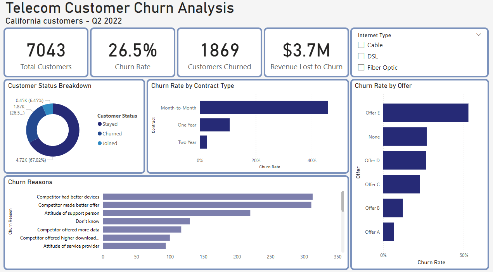
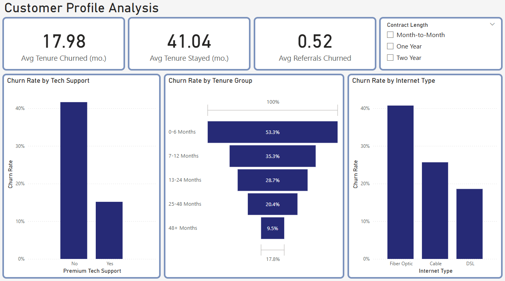
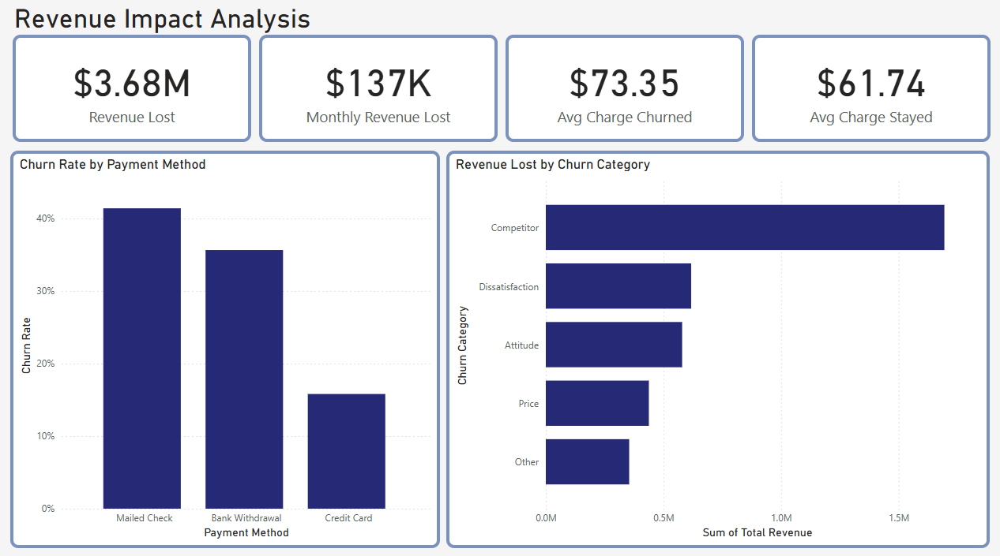
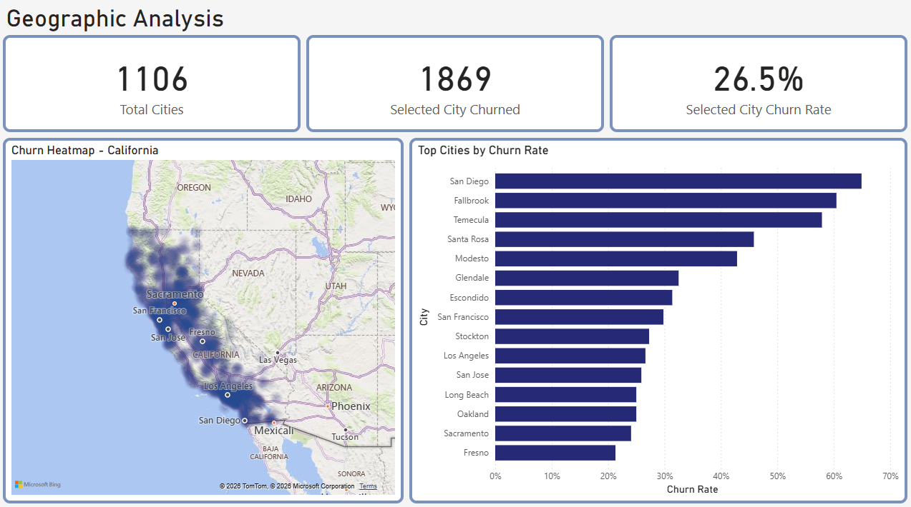

# Telecom Customer Churn Analysis

**Tools:** SQL (SQLite) · Power BI  
**Data:** Maven Analytics · 7,043 California telecom customers · Q2 2022  
**Author:** Thomas Milosavljevic · [LinkedIn](https://www.linkedin.com/in/thomas-milo/) · [GitHub](https://github.com/ThomasMilosavljevic)

---

## Overview

This project analyzes customer churn for a California-based telecom company. Using SQL for data exploration and Power BI for visualization, the goal was to identify the key drivers of churn, quantify the revenue impact, and deliver actionable retention recommendations.

> **26.5% churn rate · 1,869 customers lost · $3.68M in revenue lost**
---
## 📊 Dashboard Preview

### Page 1 · Overview

### Page 2 · Customer Profile

### Page 3 · Revenue Impact

### Page 4 · Geographic Analysis

---

## 📈 Quick Stats

| Metric | Value |
|--------|-------|
| Overall churn rate | 26.5% |
| Month-to-Month churn rate | 45.8% |
| Two-Year contract churn rate | 2.5% |
| Churn rate · no tech support | 41.6% |
| Churn rate · with tech support | 15.2% |
| Fiber Optic churn rate | 40.7% |
| Total revenue lost | $3.68M |
| Monthly revenue at risk | $137K |
| Avg monthly charge · churned | $73.35 |
| Avg monthly charge · stayed | $61.74 |
| Highest churn city | San Diego (64.9%) |
| #1 churn reason | Competitor had better devices (16.7%) |

---

## 🔗 Links

- [Full Analysis and Recommendations](analysis/analysis.md)
- [SQL Queries](sql/telecom_churn_analysis.sql)

---

*Dataset: [Maven Analytics Data Playground](https://mavenanalytics.io/data-playground)*
